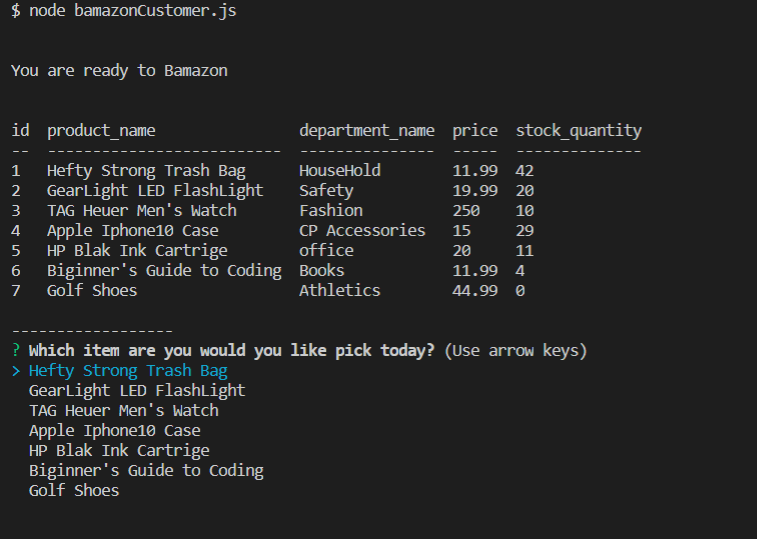
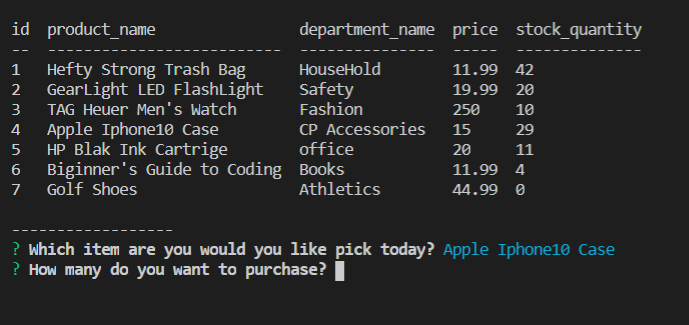
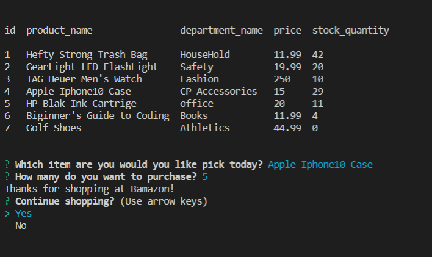
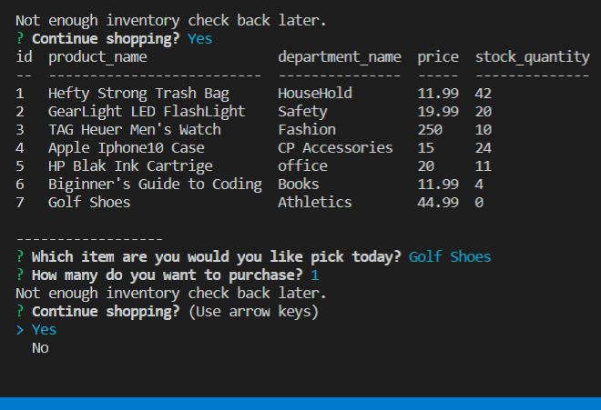
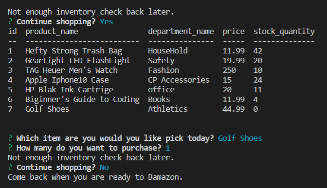

# Lusso's Bamazon

_**Time to get your Bamazon on!**_

This Bamazon application is a console-based e-commerce shop using MySQL and Node.js that takes orders and tracks inventory and can report on top items / departments.

Getting Started
These instructions will assist you in installing and using bamazon.

## First things first:
In your bash, do a git clone  with  git@github.com:Mlusso06/bamazon_Hw12.git

#### start your npm installs
Dependencies

* npm install inquirer
* npm install mysql
* npm install console.table

## Now on to running the app
_Running bamazon_

To shop on _bamazon_, simply run the following code while in your local bamazon directory:

* node bamazonCustomer.js

To Act as the store _Manager_, run the following code in your local bamazon directory:

* node bamazonManger.js
    
### How it works
  View these Screen shots:

### Customer:
start 

How much do you want?

Add a quantity of the item

Buy items with no Inventory- get an error

Stop your Shopping experiance

### Customer view
 *  The program will display a table of available items available for purchase and then prompt you for your choice.
* Once you choose an item, the program will ask you how many items you'd like to purchase.
* Assuming you have requested an amount that does not exceed the overall stock, you will have successfully purchased the item, and the store's stock will reflect your purchase.

### Manager view
 The program will give the user a few managerial options including:
* _View inventory:_ Displays the entire inventory of products
* _View low inventory:_ Displays any products in the inventory that have less than 5 items in stock
* _Add to inventory:_ Allows user to update inventory with more stock
* _Add new product:_ Allows user to add a a new item to the database
* _Quit:_ Ends the connection